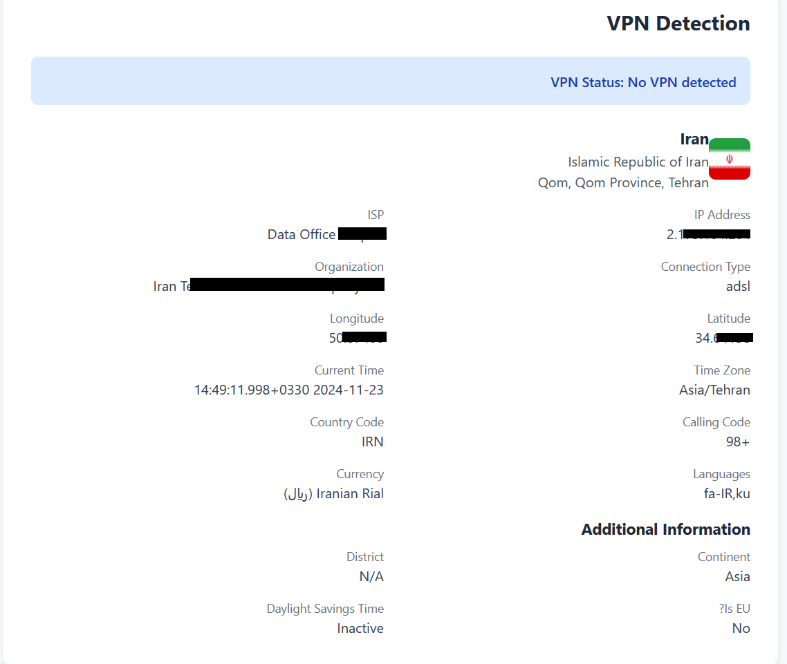
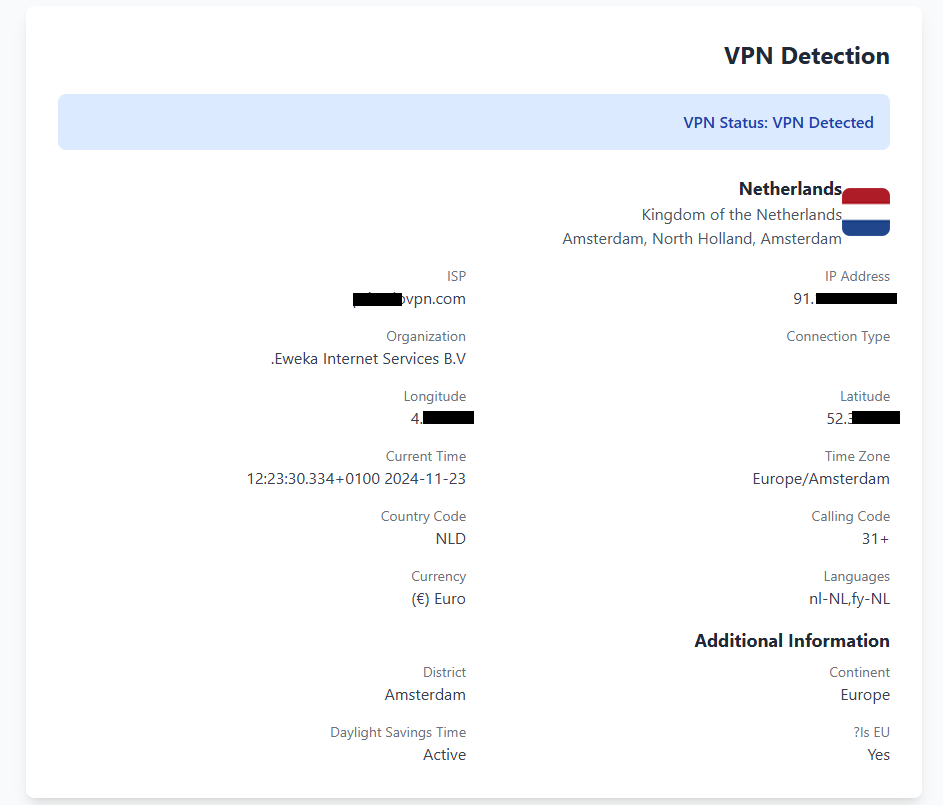

# React VPN Detector

[](https://badge.fury.io/js/react-vpn-detector)

`react-vpn-detector` is a lightweight and efficient React library for detecting VPN usage in your applications. It leverages IP geolocation APIs to provide detailed user location and ISP data, making it ideal for security checks, access control, and advanced analytics.

---

## Features

- **Easy-to-use React Hook**: Simplify integration with your React app using the `useVPNDetector` hook.
- **Detailed User Data**: Get information like IP address, country, ISP, timezone, and more.
- **VPN Detection**: Identify VPN or proxy usage with customizable logic.
- **Fully Typed**: Written in TypeScript for type safety and better developer experience.
- **Beautiful Output**: Compatible with Tailwind CSS for elegant UI designs (example included).

---

## Installation

To get started, install the package via npm:

```bash
npm install react-vpn-detector
```

Or with Yarn:

```bash
yarn add react-vpn-detector
```

---

## Usage

### Basic Setup

Use the `useVPNDetector` hook in your React components to detect VPN usage and fetch user details.

```tsx
import React from 'react';
import { useVPNDetector } from 'react-vpn-detector';

const App = () => {
  const { isUsingVPN, data, error } = useVPNDetector({
    apiUrl: 'https://api.ipgeolocation.io/ipgeo?apiKey=YOUR_API_KEY', // you can get it free from https://ipgeolocation.io/
  });

  if (error) {
    return <div>Error: {error}</div>;
  }

  return (
    <div>
      {isUsingVPN ? (
        <p>VPN Detected: Your ISP appears to be a VPN or proxy.</p>
      ) : (
        <p>No VPN detected.</p>
      )}
      <pre>{JSON.stringify(data, null, 2)}</pre>
    </div>
  );
};

export default App;
```

### Note

You can show vpn Detection in a Modal ,MessageBox ,Alert or just use that in a logic.

### API Response Data

When the API call is successful, you get detailed user information such as:

- **IP Address**: The user's public IP address.
- **Location**: City, state, country, and continent.
- **ISP Details**: Internet Service Provider and connection type.
- **Time Zone**: Current time, timezone name, and DST status.
- **Currency**: Currency name, code, and symbol.
- **Languages**: Primary languages spoken in the user's region.

---

## Styling with Tailwind CSS

Here’s an example output styled with Tailwind CSS. Customize it to fit your app's theme.

### Output Example 1 (No VPN Detected)



### Output Example 2 (VPN Detected)



---

## Hook API

### `useVPNDetector(options)`

#### Parameters:

- **`options`**:
  - **`apiUrl`**: _(required)_ The URL of the IP geolocation API. Example: `https://api.ipgeolocation.io/ipgeo?apiKey=YOUR_API_KEY`.

#### Returns:

- **`isUsingVPN`**: `boolean` - Indicates whether the user is using a VPN or proxy.
- **`data`**: `object` - The complete API response containing user details.
- **`error`**: `string | null` - Any error encountered during the API call.

---

## Advanced Usage

### Custom VPN Detection Logic

You can customize the VPN detection logic based on your requirements. For example, modify the `useVPNDetector` hook in your project:

```tsx
const isUsingVPN =
  /vpn|proxy/i.test(data.isp) || /vpn|proxy/i.test(data.connection_type || '');
```

This checks if the ISP or connection type matches VPN-related keywords.

---

## Example with Tailwind CSS

The following example demonstrates a complete VPN detection component styled with Tailwind CSS:

```tsx
import React from 'react';
import { useVPNDetector } from 'react-vpn-detector';

const App = () => {
  const { isUsingVPN, data, error } = useVPNDetector({
    apiUrl: 'https://api.ipgeolocation.io/ipgeo?apiKey=YOUR_API_KEY', // you can get it free from https://ipgeolocation.io/
  });

  if (error) {
    return (
      <div className='flex justify-center items-center h-screen bg-red-50'>
        <div className='p-4 bg-white shadow-md rounded-lg'>
          <h1 className='text-xl font-semibold text-red-500'>Error</h1>
          <p className='text-gray-700 mt-2'>{error}</p>
        </div>
      </div>
    );
  }

  return (
    <div className='min-h-screen bg-gray-50 flex flex-col items-center py-10'>
      <div className='bg-white shadow-lg rounded-lg p-8 max-w-4xl w-full'>
        <h1 className='text-2xl font-bold mb-6 text-gray-800'>VPN Detection</h1>
        <div
          className={`p-4 rounded-lg ${
            isUsingVPN
              ? 'bg-red-100 text-red-800'
              : 'bg-green-100 text-green-800'
          }`}
        >
          <p className='font-semibold'>
            VPN Status: {isUsingVPN ? 'VPN Detected' : 'No VPN detected'}
          </p>
        </div>
        {data && (
          <div className='mt-6 space-y-6'>
            <div className='flex items-center space-x-4'>
              
              <div>
                <h2 className='text-lg font-bold text-gray-800'>
                  {data.country_name}
                </h2>
                <p className='text-gray-600'>{data.country_name_official}</p>
                <p className='text-gray-600'>
                  {data.city}, {data.state_prov}, {data.country_capital}
                </p>
              </div>
            </div>
          </div>
        )}
      </div>
    </div>
  );
};

export default App;
```

---

## Contribution

Feel free to submit issues or contribute to this project via GitHub:
[GitHub Repository](https://github.com/ahmad-ahmadnejad/react-vpn-detector)

---

## my website

you can see my article,s at [frontendi.com](https://frontendi.com/)
[find me at telegram](https://t.me/A_A_DEV)
[or linkedin](https://www.linkedin.com/in/ahmad-ahmadnejad/)
